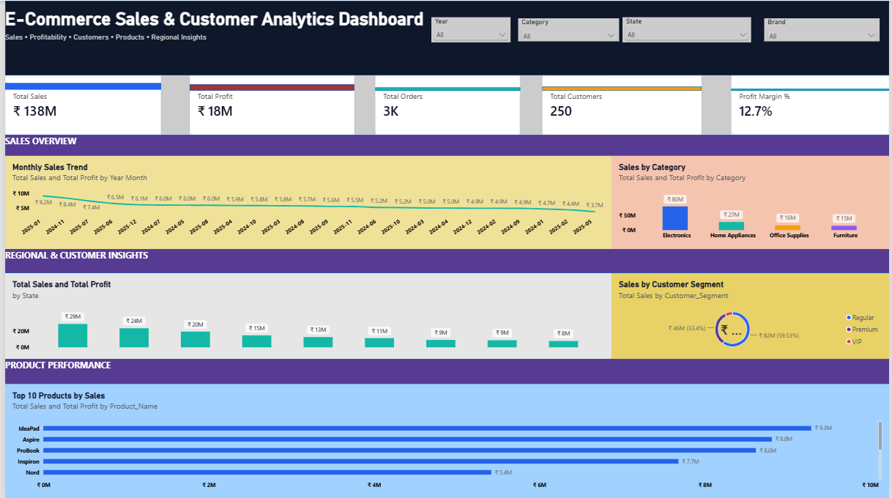

# E-Commerce Sales & Customer Analytics Dashboard

## 📊 Project Overview

The **E-Commerce Sales & Customer Analytics Dashboard** is an interactive Power BI project designed to analyze sales performance, profitability, customer behavior, product performance, and regional sales trends.

The dashboard provides a single-page executive overview with interactive filters and KPIs, allowing users to explore business performance across different years, categories, states, and brands.

---

## 🎯 Project Objectives

- Analyze overall e-commerce sales and profitability.
- Track key business KPIs such as Sales, Profit, Orders, Customers, and Profit Margin.
- Identify monthly sales trends.
- Compare sales performance across product categories and states.
- Analyze customer segments.
- Identify the top-performing products based on sales.
- Enable interactive analysis using slicers.

---

## 🛠️ Tools & Technologies

- **Power BI Desktop**
- **Power Query**
- **DAX**
- **Microsoft Excel**
- Data Modeling

---

## 📂 Dataset

The project uses an e-commerce dataset containing multiple related tables:

### Sales
Contains transaction-level information such as:
- Order ID
- Order Date
- Customer ID
- Product ID
- Quantity
- Unit Price
- Discount
- Shipping Cost
- Payment Mode
- Net Sales
- Cost
- Profit

### Customers
Contains:
- Customer ID
- Customer Name
- Gender
- Age
- City
- State
- Customer Segment

### Products
Contains:
- Product ID
- Product Name
- Category
- Sub-Category
- Brand
- Cost Price
- Selling Price

### Returns
Contains:
- Return ID
- Order ID
- Return Date
- Return Reason

---

## 🔄 Data Preparation

Data preparation was performed using **Power Query**.

Key steps included:

- Correcting data types.
- Cleaning and structuring columns.
- Preparing date fields.
- Creating relationships between tables.
- Handling numerical fields for sales, cost, and profit analysis.
- Building a dedicated Date table for time-based analysis.

---

## 🔗 Data Model

The project uses a relational data model connecting:

- `Customers` → `Sales`
- `Products` → `Sales`
- `Sales` → `Returns`
- `DateTable` → `Sales`

This model allows the dashboard visuals and DAX measures to respond dynamically to user selections.

---

## 📐 DAX Measures

Key measures created for the dashboard include:

- Total Sales
- Total Profit
- Total Orders
- Total Customers
- Total Quantity
- Average Order Value
- Profit Margin %
- Previous Month Sales
- MoM Growth %
- Previous Year Sales
- YoY Growth %

Example:

```DAX
Total Sales =
SUM(Sales[Net_Sales])
```

```DAX
Total Profit =
SUM(Sales[Profit])
```

```DAX
Profit Margin % =
DIVIDE(
    [Total Profit],
    [Total Sales]
)
```

---

## 📊 Dashboard Preview



---

## 💡 Key Insights

- Monitored overall sales and profitability using executive KPIs.
- Compared sales performance across product categories and states.
- Analyzed customer segments to understand revenue contribution.
- Identified top-performing products based on sales.
- Enabled interactive analysis using Year, Category, State, and Brand slicers.

---

## 👩‍💻 Author

**Vaddella Sai Harshitha**

Computer Science Graduate | Data Analytics | Python Development
